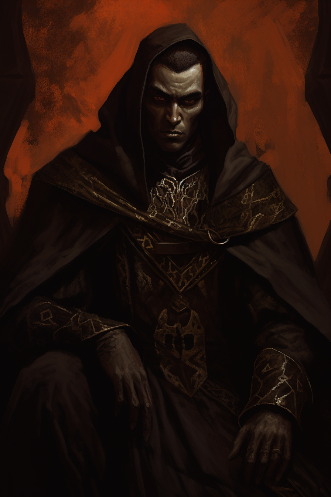

## Allgemeine Informationen

### Questlog

- Der Nekromant Vornis hat in einem Bauernhaus ausserhalb von Phandalin Tote vom Friedhof Friedenshügel zu einem neuen Wesen zusammengesetzt.

>[!question] Wer ist Vornis Noquar?

## Hinweise
>[!note] Brief an A. Nachtigall
>
>*"die Forschungen gehen voran, ich habe es geschafft ein neues Lebewesen zu erschaffen, ich komme demnächst zur Zitadelle und stelle meine Arbeit vor. ~Die schwarze Hand"*

>[!tip] Fundsachen
>
>Eichenhammer Amulett
>Buch *"Der Kriegsheld Thadgar Eichenhammer"* 
>Buch *"Anatomie der Lebewesen"*
>Phiolen mit roter Flüssigkeit

