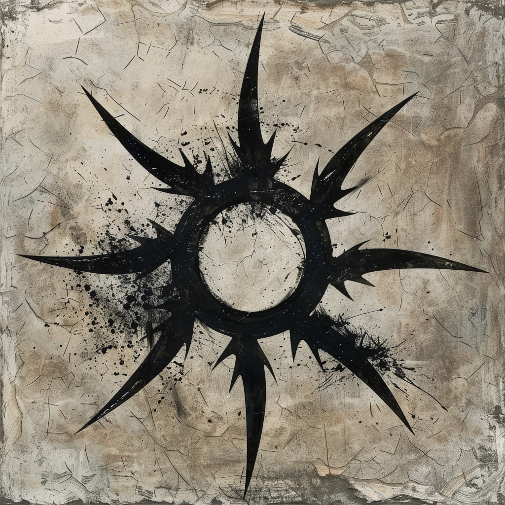

## Allgemeine Informationen

>[!question] Wer ist die Familie Nachtigall?

### Questlog

- Im Keller des Bauernhauses von Vornis Noquar befand sich ein Brief, der für die Familie Nachtigall bestimmt war.
- Es gibt einen Ort, der sich Zitadelle nennt.
- Soldaten, die der Familie Nachtigall zugeordnet werden können, suchen 5 Abenteuer.

>[!tip] Hinweise

