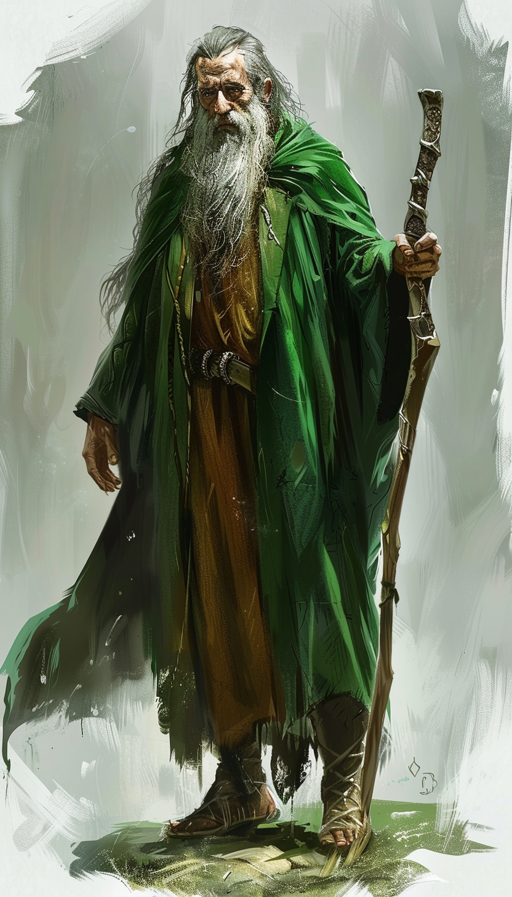

>[!question] Wer ist Reidoth?

Reidoth ist ein alter männlicher Druide mit grauen Bart. Er freundlich und redet wenig. 

>[!note] Was weiß Reidoth?

- Reidoth sagt, dass sich im Turm ein Drache namens Giftfang befindet.
- In einem Gebäude am Rande der Stadt sind Drachenkultisten.
- In einem alten Laden befinden sich Spinnen.